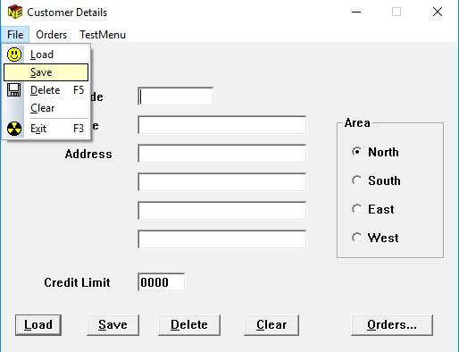

# DSOfficeMenus
Skinning a COBOL Dialog System Application to make menus look like Office XP with gradients.

Demo used the standard customer demo supplied with GUI Dialog.

It uses custom draw of Windows Menus to add a gradient bar and icons.

